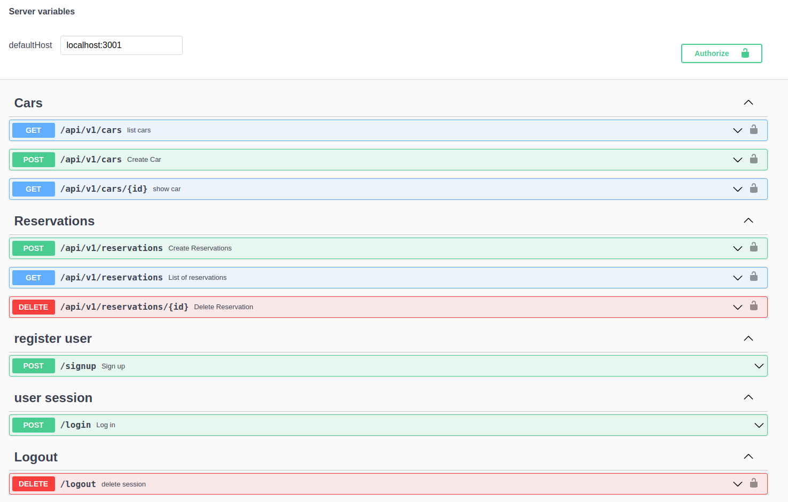

# Rent a Car back-end

## General info

Creating API end point using Ruby on Rails. The API includes user authentication and authorization with gem 'devise-jwt'. You can sign-up, login and logout. Also if user is authenticated can create if has role admin and delete cars. Otherwise user can see cars, car info and make reservation and list reservations. This back-and APi is connected and used in front end with React JS.

## Link to front-end 

## Setup
To run this project, install it locally using:
- cd Desktop
- git clone https://https://github.com/VuDej/rent-a-car-backend.git
- cd rent-a-car-backend
- bundle install
- rails db:create
- rails db:migrate
-rails s

## Notice:
- create new user with this json code: 
{ "user": {
    "name": "some",
    "email": "some@mail.com",
    "password": "1111111",
    "password_confirmation": "1111111"
}}
-login with this json code: 
{ "user": {
    "email": "some@mail.com",
    "password": "1111111",
}}
- when create reservation add car id: 
car_id: (exising car id from database)

## Live preview
  ## Heroku [link]()

## Screenshots

## Contents
* [users](#users)
* [cars](#cars)
* [reservations](#reservations)

## Technologies
Project is created with:
* Ruby
* Ruby on Rails
* PostgresSQL

## Author 1

👤 **Dejan Vujovic**

- Github : [@VuDej](https://github.com/VuDej)
- Twitter: [@DejanVuj](https://twitter.com/DejanVuj)
- LinkedIn : [@Dejan-Vujovic](https://www.linkedin.com/in/dejan-vujovic-5a0672225/)

## 🤝 Contributing

Contributions, issues, and feature requests are welcome!

Feel free to check the [issues page](https://github.com/VuDej/rent-a-car-backand/issues/2).

## Show your support

Give a ⭐️ if you like this project!

## Acknowledgments

- A special thanks to Microverse.

## 📝 License

This project is [MIT](LICENSE.md) licensed.

## Contact
Created by [@VuDej](https://github.com/VuDej)

